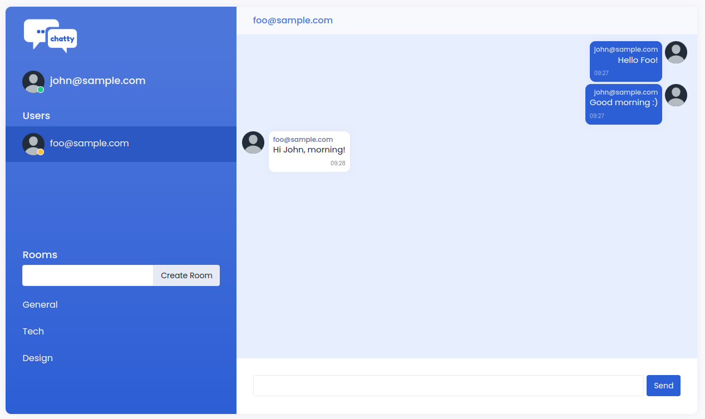

# Chatty

You can see and try the app here: [Chatty](https://safe-savannah-05773.herokuapp.com/).

## Table of Content
- [Technologies](#technologies)
- [Requirements](#requirements)
- [Local Setup](#local-setup)
## Technologies
- Ruby 3.0.0
- Ruby on Rails 7.0.4.2
- Postgres >= 14
- Test: RSpec, Capybara, Selenium, Database Cleaner
- Gems
  - active_storage_validations
  - ajax-datatables-rails
  - devise
  - factory_bot_rails
  - faker
  - image_processing
  - letter_opener
  - pg
  - pry
  - puma
  - pundit
  - rails
  - redis
  - rspec
  - rubocop
  - sass-rails
  - shoulda
  - shoulda-matchers
  - simplecov
  - stimulus-rails
  - turbo-rails
  - webpacker

## Requirements
These should be installed before you get started:
- Ruby version 3.0.0
- Bundler
- Postgres >= 14
- Git
- NodeJS version 14
- ImageMagick
- Redis
## Local Setup
1. Run `bundle install`.
2. Install yarn `brew install yarn` or `nvm install yarn`
3. Run `yarn install`
4. Run `redis-server` to start redis
5. Run `rake db:setup db:test:prepare` to setup databases.
6. Run `bin/webpack-dev-server`
7. Run `rails s` to run rails server in development.
8. Run `rspec spec/` to run testing. After this, it will generates `coverage` directory inside project's directory.
